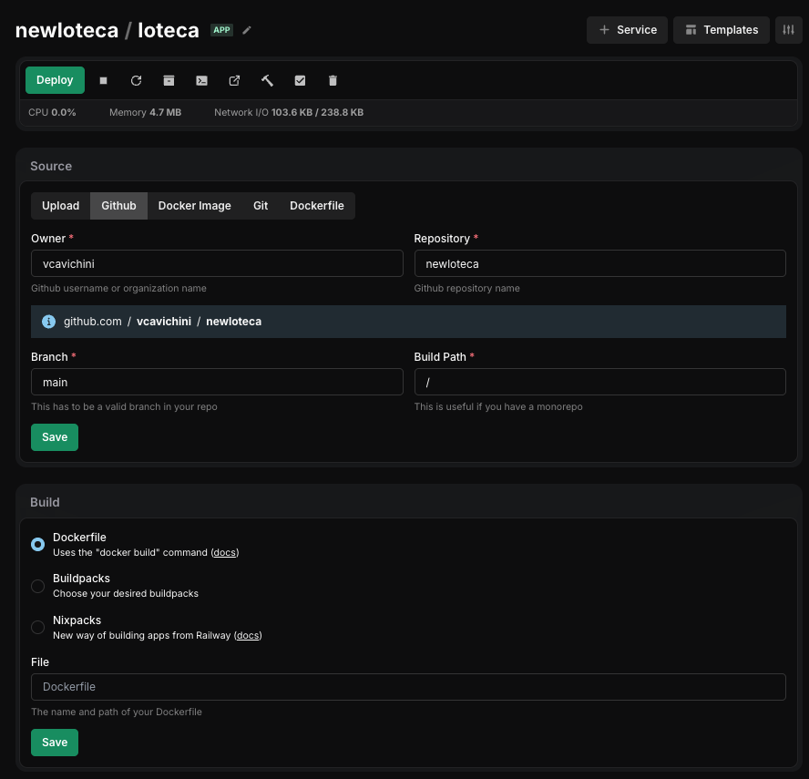

# NewLoteca - Conferidor da Mega-Sena

Este é um aplicativo web simples escrito em Go para conferir resultados da Mega-Sena e compará-los com suas apostas.

## Funcionalidades

- **Consulta de Resultados**: Busca automaticamente os dados do sorteio mais recente ou de concursos anteriores.
- **Conferência de Apostas**: Compara seus jogos cadastrados com os números sorteados.
- **Destaque Visual**: Mostra quais números você acertou e quantos acertos fez em cada jogo.
- **Informações de Prêmios**: Exibe a distribuição de prêmios e ganhadores.
- **Navegação**: Permite navegar facilmente entre os concursos.

## Como Executar

### Pré-requisitos

- [Go](https://go.dev/dl/) instalado na sua máquina.

### Rodando Localmente

1.  Clone o repositório ou baixe os arquivos.
2.  Abra o terminal na pasta do projeto.
3.  Execute o comando:

    ```bash
    go run main.go
    ```

4.  Abra o navegador e acesse: [http://localhost:8080](http://localhost:8080)

### Rodando com Docker

Se preferir usar Docker:

1.  Construa a imagem:
    ```bash
    docker build -t newloteca .
    ```
2.  Execute o container:
    ```bash
    docker run -p 8080:8080 newloteca
    ```

### Deploy no Easypanel

Para fazer o deploy desta aplicação no [Easypanel](https://easypanel.io/):

1.  **Crie um Novo Serviço**: No seu painel do Easypanel, crie um novo serviço do tipo **App**.
2.  **Origem do Código**: Selecione **Git** e conecte o repositório onde este código está hospedado.

    

3.  **Configuração de Build**:
    - Escolha **Dockerfile** como método de build.
    - O Easypanel detectará automaticamente o `Dockerfile` na raiz do projeto.
4.  **Porta da Aplicação**:
    - Nas configurações do serviço, vá em "Domains" ou "Network".
    - Certifique-se de que a porta do container está definida como **8080**.
5.  **Arquivo de Apostas**:
    - Certifique-se de que o arquivo `bets.json` foi commitado no repositório Git. O Dockerfile irá copiá-lo para dentro da imagem durante o build.
    - _Opcional_: Se quiser alterar as apostas sem precisar fazer um novo deploy, você pode montar o `bets.json` como um **Volume** (Bind Mount) apontando para `/app/bets.json` (ou o diretório de trabalho definido no Dockerfile).

## Configurando suas Apostas (`bets.json`)

O arquivo `bets.json` é onde você cadastra seus jogos. Ele deve estar na mesma pasta do executável (ou na raiz do projeto).

O arquivo possui duas seções principais:

1.  **`permanent`**: Jogos que você joga em **todos** os concursos (teimosinhas ou jogos fixos).
2.  **`one_off`**: Jogos que você fez apenas para um concurso específico.

### Estrutura do Arquivo

```json
{
  "permanent": [
    ["01", "02", "03", "04", "05", "06"],
    ["10", "20", "30", "40", "50", "60"]
  ],
  "one_off": {
    "2480": [
      ["05", "15", "25", "35", "45", "55"],
      ["08", "18", "28", "38", "48", "58"]
    ],
    "2500": [["11", "22", "33", "44", "55", "66"]]
  }
}
```

### Instruções Importantes

- **Formato dos Números**: Os números devem ser sempre **strings** (entre aspas duplas) e com dois dígitos (ex: "01", "09", "10").
- **Jogos Permanentes**: Adicione seus arrays de jogos dentro da lista `"permanent"`.
- **Jogos Específicos**: Em `"one_off"`, a chave deve ser o **número do concurso** (como string, ex: "2480") e o valor é uma lista de jogos para aquele concurso.
- **Atualização**: O arquivo é lido a cada atualização da página, então você pode editá-lo e apenas recarregar o navegador para ver as mudanças.
